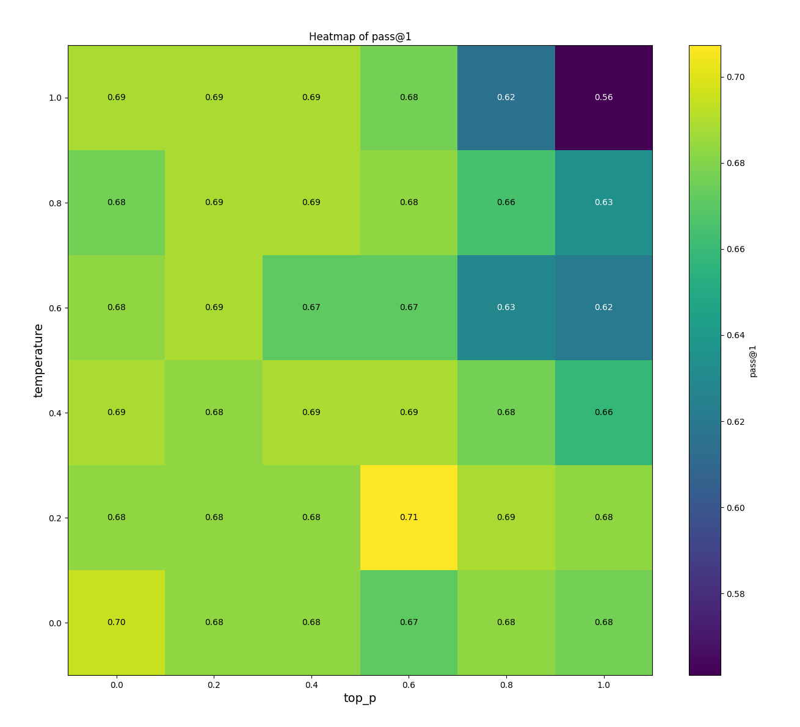

# OpenAI's human-eval sampling benchmark

This repo utilizes the OpenAI `human-eval` dataset to determine optimal values for the `temperature` and `top_p` parameters when sampling solutions from the `GPT-4` model.

Through multi-threading at the level of parameter combinations, `human-eval` problem solution generation, and solution `eval` evaluation this benchmark runs in under 30 seconds.

## Example run
We include an example run for different values of `temperature` and `top_p` ranging from `0.0` to `1.0` with a step size of `0.2`. Check the `CONFIG` section in [1_run_eval.py](1_run_eval.py) to run the test for different ranges.



## Instructions
Make sure you have `make` and `Python 3` installed. It's recommended to create and activate a virtual environment before running the make commands.

Be sure to have sourced an `OPENAI_API_KEY` to allow for LLM generation.

```bash
python -m venv .venv
source .venv/bin/activate
```

`make install`

`make run-bench`

`make plot`

Or simply:

`make`


## Caveat 
Note that the OpenAI documentation generally advises to vary either `temperature` or `top_p` and not both. However, it's not entirely clear why one should only vary either. More details in this [thread](https://community.openai.com/t/a-better-explanation-of-top-p/2426/8).
